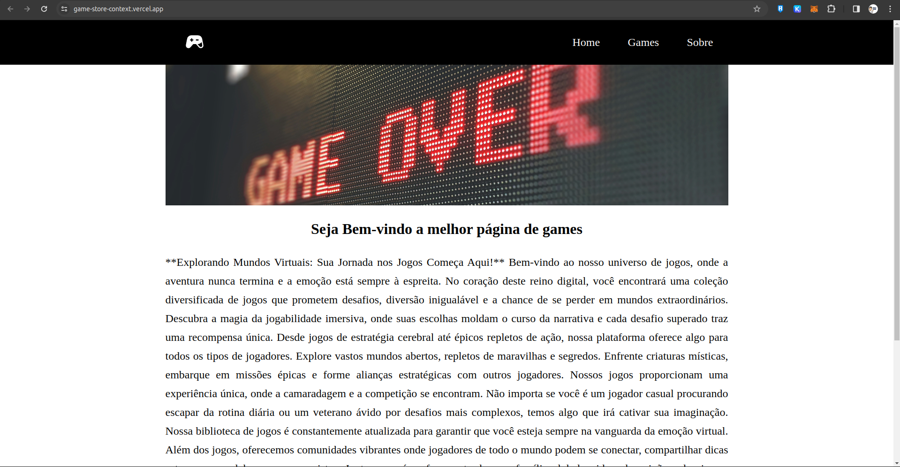

<h1 align="center"> Game Store </h1>

<p align="center">
  Repositório referente ao desenvolvimento do front-end da aplicação de game utilizando contextAPI.<br/>
</p>

<p align="center">
  <a href="#-tecnologias">Tecnologias</a>&nbsp;&nbsp;&nbsp;|&nbsp;&nbsp;&nbsp;
    <a href="#-instalacao-do-projeto">Instalação do projeto</a>&nbsp;&nbsp;&nbsp;|&nbsp;&nbsp;&nbsp;
  <a href="#-sobre-o-projeto">Sobre o Projeto</a>&nbsp;&nbsp;&nbsp;
</p>

<p align="center">
  
</p>

<p align="center">
  <a href="https://game-store-context.vercel.app/" target="_blank">➡️ Acesse o deploy!</a>
</p>

## 🚀 Tecnologias

Esse projeto foi desenvolvido com as seguintes tecnologias:

- React (Vite)
- TypeScript
- HTML
- CSS
- Component Styled
- Json Server

## ⚙️ Instalação do projeto

Passo-a-passo:

1. Clone o repositório através desse link:

```
https://github.com/fabricio-milanio/vs13-front-04-context-task02
```

2. Execute os seguintes comandos:

```
npm i
npm start
```

3. Para utilizar a aplicação, instale o JSON Server com os seguinte comando:

```
npm install -g json-server
```

4. Em seguinda crie um arquivo com o nome db.json, com a seguinte estrutura:

```
{
  "games": [
   {
    "id": "1136",
    "title": "Overwatch 2",
    "thumbnail": "https://www.mmobomb.com/g/1136/thumbnail.jpg",
    "short_description": "Big changes come to the Overwatch formula in this sequel...and so does PvE content, eventually.",
    "game_url": "https://www.mmobomb.com/open/overwatch-2",
    "genre": "Shooter",
    "platform": "PC (Windows)",
    "publisher": "Activision Blizzard King",
    "developer": "Blizzard Entertainment",
    "release_date": "2022-10-04",
    "profile_url": "https://www.mmobomb.com/overwatch-2"
  },
  ]
}
```

5. Execute o servidor com o comando abaixo:

```
json-server --watch ./src/db/db.json
```

## Notas

Foi utilizado o Json Server devido um problema com a api utilizada inicialmente. Tive um problema com CORS que não consegui contornar e para que a aplicação funcionasse, foi necessário mockar os dados.

- JSON Server é apenas para desenvolvimento;

## 💻 Sobre o Projeto

A Game Store é um espaço para todos os amantes de jogos, que buscar se divertir e fazer novas amizades.
